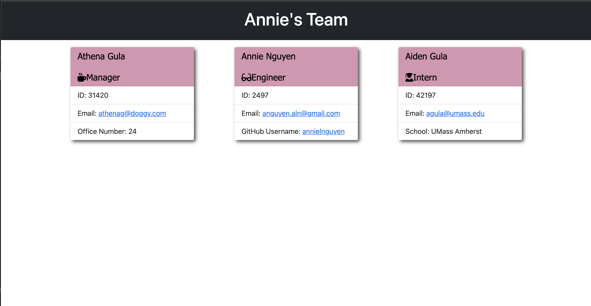

  

# Project Name: Team-Profile-Generator
https://github.com/annielnguyen/Team-Profile-Generator
## Description
This is a Node.js command-line application was created in order for a user to generate a webpage that displays team members' profiles. 
Users will be prompted to enter each team members' information. All of the employees' profiles will include their name, employee ID, and email address. Additional questions will be prompted based on the role selected. For Managers, an office number will be included. For interns, the school in which they obtained their highest level of education will be required. Lastly, GitHub usernames will be included in the engineer profiles. Please watch my demo here: https://watch.screencastify.com/v/i1qi1ok6ZVCycDmE6o24

## Table of Contents
  
* [License](#license)
* [Installation](#installation)
* [Usage](#usage)
* [Contribution](#contribution)
* [Tests](#tests)
* [Questions](#questions)
  

## License
This project is licensed under the MIT license. 
  
## Installation
  Please install these dependencies to run this application: Inquirer and Jest
## Usage
  To use this app, please run it in your terminal.

## Contribution
  ​Contributors: N/A

## Tests
  The following is needed to run the test: npm run test and node index.js

## Questions
  My GitHub profile link is: https://github.com/annielnguyen.
  If you have any questions regarding this app, please contact directly at: anguyen.aln@gmail.com.
  